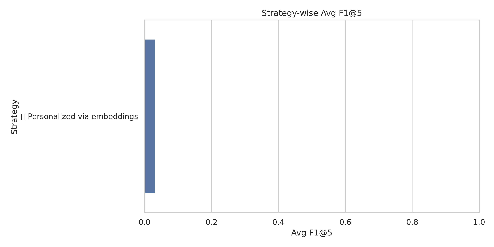
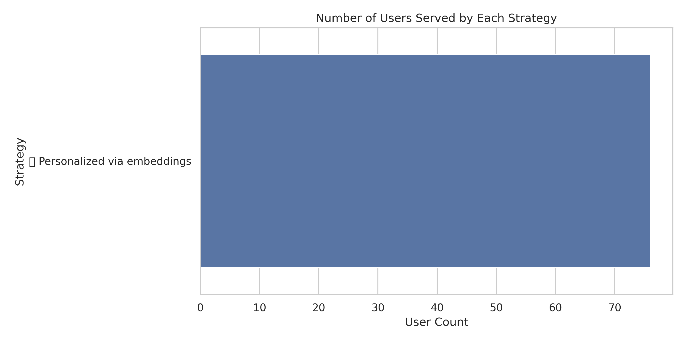
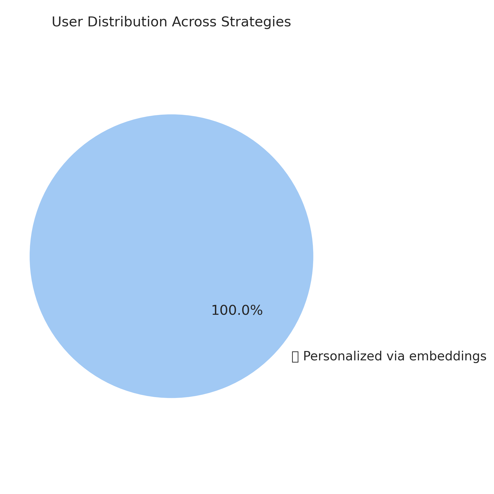

# 🛣️ Project Roadmap

A clear roadmap helps collaborators, recruiters, and stakeholders track progress and upcoming features. Below are the planned milestones for this recommendation system.

---

## v1.0 – Baseline MVP (Completed)

- Personalized recommendation logic (SVD, Node2Vec, Item-Item)
- Fallback strategies (co-purchase, co-search, popularity)
- Modular evaluation framework (Precision@5, Recall@5, F1@5)
- Visualizations:
  - F1 score comparison 
  - Strategy-wise user counts 
  - User distribution pie chart 
- Summary report & notebook

---

## v1.1 – Personalization & Config Enhancements (Planned)

- Cold-start onboarding with light user context
- Config-driven toggling of recommendation strategies (via YAML or JSON)
- Streamlined folder structure for experiment tracking
- More robust testing and validation framework

**ETA:** Q3 2025

---

## v2.0 – Deployment & Explainability (Future)

- Streamlit-based interactive UI for recommendation exploration
- Explainability API layer to return metadata-based rationale
- Docker containerization for portable deployment
- Monitoring module to track real-time recommendation performance

**ETA:** Q4 2025

---

Stay tuned as we evolve this pipeline to support broader, production-grade use cases!
